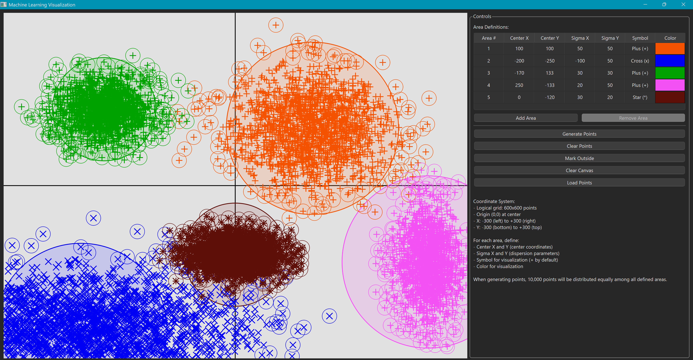

# Machine Learning Visualization Demo

A Qt-based application for visualizing and exploring Gaussian distributions in machine learning. This tool allows you to define multiple areas with different parameters, generate points according to those distributions, and analyze the results.



## Features

- **Interactive Drawing Area**: A 600x600 grid with origin at the center, ranging from -300 to +300 on both axes
- **Area Definitions**: Create multiple Gaussian distribution areas with customizable parameters:
  - Center X and Y coordinates
  - Sigma X and Y (dispersion parameters)
  - Symbol type (Cross, Plus, or Star)
  - Color
- **Point Generation**: Generate 10,000 points distributed equally among all defined areas, following Gaussian distributions
- **Outlier Detection**: "Mark Outside" feature highlights points that fall outside their expected distribution area
- **Save/Load Functionality**: All settings and generated points are automatically saved and loaded between sessions
- **Customizable UI**: Draggable splitter to adjust the layout between the drawing area and controls

## Usage

### Defining Areas

1. Click the "Add Area" button to create a new Gaussian distribution area
2. Configure the parameters in the table:
   - Center X and Y: Define the center of the Gaussian distribution
   - Sigma X and Y: Control the spread of points (higher values = wider spread)
   - Symbol: Choose the visual representation for points (Cross, Plus, or Star)
   - Color: Select a color for the area and its points

### Generating and Analyzing Points

1. Click "Generate Points" to create 10,000 points distributed across all defined areas
2. Generated points follow Gaussian distributions based on each area's parameters
3. Use "Mark Outside" to highlight points that fall outside their expected distribution areas
4. Click "Clear Points" to remove all generated points
5. "Clear Canvas" will remove points but keep area definitions
6. Points can be loaded from a previous session with "Load Points"

### Understanding the Visualization

- Each area is represented by a circle with a radius of 3 times the sigma values
- Points are colored according to their respective area's color
- When using "Mark Outside", outlier points are marked with a circle in their area's color
- The probability threshold for determining outliers is 5% of the maximum probability at the center

## Technical Details

- **Programming Language**: C++ with Qt framework
- **Distribution Model**: 2D Gaussian probability density function
- **Point Generation Algorithm**: Acceptance-rejection sampling method
- **Data Storage**: 
  - Area definitions saved in INI format
  - Points saved in CSV format
  - Application settings (UI layout) saved in INI format
- **File Location**: All data files are stored in the application's executable directory

## Installation

### Prerequisites

- Qt 5.12 or higher
- C++11 compatible compiler

### Building from Source

1. Clone the repository
2. Open the project in Qt Creator
3. Configure the project for your platform
4. Build and run

### Standalone Installation

1. Download the latest release for your platform
2. Extract the archive to any directory
3. Run the executable

## Data File Formats

### Area Definitions (areaDefinitions.ini)

Stores area parameters in QSettings INI format:

```
[AreaDefinitions]
1\AreaNumber=1
1\CenterX=0
1\CenterY=0
1\SigmaX=50
1\SigmaY=50
1\SymbolType=1
1\Color=@Variant(\0\0\0\x43\x1\xff\xff\0\0\0\0\xff\xff\0\0)
...
```

### Points Data (points.csv)

Stores generated points in CSV format:

```
x;y;AreaNumber
120;-35;1
-87;42;2
...
```

## License

This project is licensed under the MIT License - see the LICENSE file for details. 